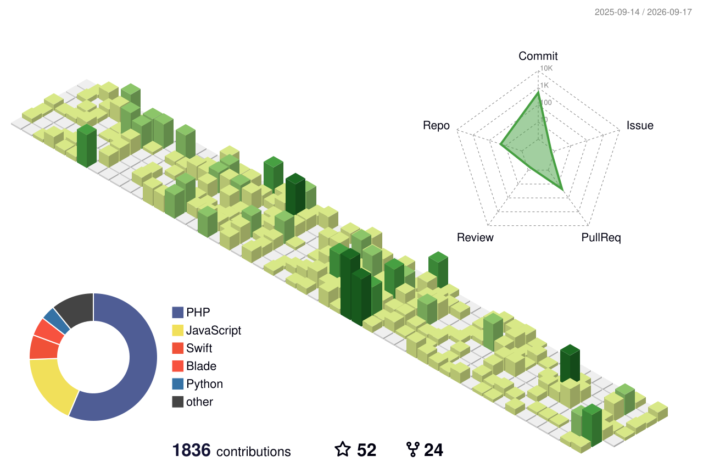

<h1> Hey! Nice to see you.</h1>

## I am [Phạm Viết Nghĩa](https://nghiane.com/)

Welcome to my page!   I'm Nghĩa, Fullstack developer from 

  

### I am learning blog writings here - [nghiane.com](https://nghiane.com)

# Blog posts
<!-- BLOG-POST-LIST:START -->
- [Polaris Web Components: Cách giữ UI không vỡ khi chuyển](https://nghiane.com/polaris-web-components-giu-ui-khong-vo-khi-chuyen)
- [PS Plus tháng 8/2026: Ba game có đáng chờ ngày 4/8?](https://nghiane.com/ps-plus-thang-8-2026-ba-game-dang-cho-ngay-4-8)
- [Xbox tương thích ngược trên PC: 4 game đầu có gì?](https://nghiane.com/xbox-tuong-thich-nguoc-pc-bon-game-dau)
- [CSS text-fit: Mình thử tiêu đề tiếng Việt trên Chrome 150](https://nghiane.com/css-text-fit-tieu-de-tieng-viet-chrome-150)
- [Epic tặng OTXO và Sol Cesto: hai roguelite rất khác nhau](https://nghiane.com/epic-tang-otxo-va-sol-cesto-hai-roguelite-rat-khac-nhau)
<!-- BLOG-POST-LIST:END -->
