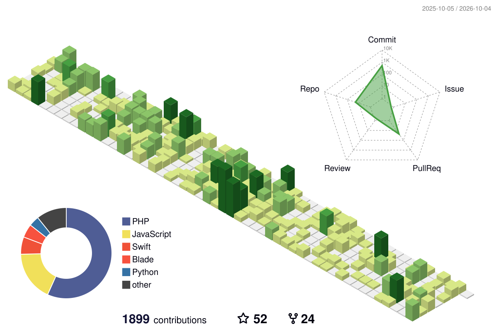

<h1> Hey! Nice to see you.</h1>

## I am [Phạm Viết Nghĩa](https://nghiane.com/)

Welcome to my page!   I'm Nghĩa, Fullstack developer from 

  

## Featured Repositories

<table>
  <tr>
    <td width="50%" valign="top">
      <h3><a href="https://github.com/polirium/polirium">polirium</a></h3>
      
Nền tảng ERP modular trên Laravel. Kiến trúc module hóa, để doanh nghiệp tự mở rộng và gắn module nghiệp vụ riêng.

      
<code>Laravel</code> <code>PHP</code> · ★ 42

    </td>
    <td width="50%" valign="top">
      <h3><a href="https://github.com/vigstudio/livewire-comments">livewire-comments</a></h3>
      
Package comment cho Laravel Livewire: gắn hệ thống bình luận vào Eloquent model, UI realtime ngay trong app.

      
<code>Laravel</code> <code>Livewire</code> · ★ 14

    </td>
  </tr>
  <tr>
    <td width="50%" valign="top">
      <h3><a href="https://github.com/vigstudio/vgcomments">vgcomments</a></h3>
      
Package comment backend cho Laravel. Tạo và gắn comment vào bất kỳ Eloquent model nào, dùng được độc lập với UI.

      
<code>Laravel</code> <code>PHP</code> · ★ 9

    </td>
    <td width="50%" valign="top">
      <h3><a href="https://github.com/vigstudio/vig-ai">vig-ai</a></h3>
      
Plugin Botble CMS sinh nội dung bằng AI cho bài viết, sản phẩm và SEO ngay trong admin panel.

      
<code>Botble CMS</code> <code>AI</code> · ★ 7

    </td>
  </tr>
  <tr>
    <td width="50%" valign="top">
      <h3><a href="https://github.com/vigstudio/vig-reactions">vig-reactions</a></h3>
      
Plugin reaction kiểu Facebook cho Botble CMS — like, love, haha… gắn được vào bài viết và sản phẩm.

      
<code>Botble CMS</code> <code>PHP</code> · ★ 7

    </td>
    <td width="50%" valign="top">
      <h3><a href="https://github.com/vigstudio/VigClean">VigClean</a></h3>
      
App native macOS viết bằng SwiftUI: dọn rác, gỡ ứng dụng và phân tích dung lượng ổ đĩa.

      
<code>SwiftUI</code> <code>macOS</code> · ★ 1

    </td>
  </tr>
</table>

### I am learning blog writings here - [nghiane.com](https://nghiane.com)

# Blog posts
<!-- BLOG-POST-LIST:START -->
- [Phân cấp thông tin UI: Audit bằng outline và tác vụ quét](https://nghiane.com/phan-cap-thong-tin-ui-audit-outline-tac-vu-quet)
- [Botble hiện giao diện cũ sau deploy: Kiểm tra theo thứ tự](https://nghiane.com/botble-giao-dien-cu-sau-deploy-cache-asset-quyen-file)
- [PS Plus tháng 10/2026: Ba game hợp kiểu chơi nào?](https://nghiane.com/ps-plus-thang-10-2026-ba-game-hop-kieu-choi)
- [Font fallback tiếng Việt: Giảm layout shift bằng size-adjust](https://nghiane.com/font-fallback-tieng-viet-size-adjust-layout-shift)
- [GitHub Copilot dynamic workflows: Có hợp release checklist?](https://nghiane.com/github-copilot-dynamic-workflows-release-checklist)
<!-- BLOG-POST-LIST:END -->
