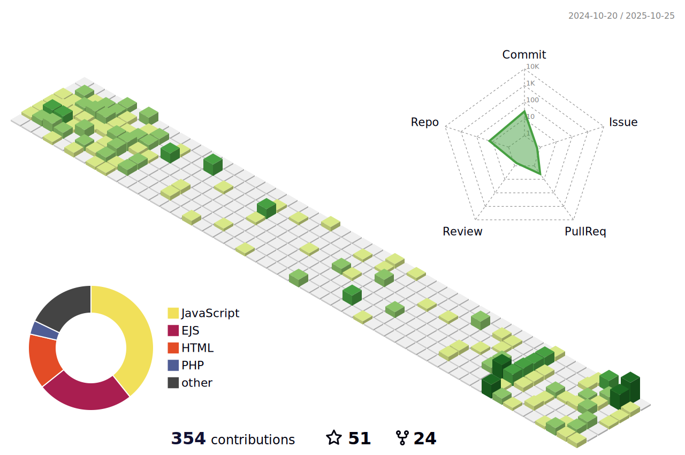

<h1> Hey! Nice to see you.</h1>

## I am [Phạm Viết Nghĩa](https://nghiane.com/)

Welcome to my page!   I'm Nghĩa, Fullstack developer from 

### I am learning blog writings here - [nghiane.com](https://nghiane.com)

# Blog posts
<!-- BLOG-POST-LIST:START -->
- [Epic Game tặng  Miễn phí game Control](https://nghiane.com/epic-game-tang-mien-phi-game-control)
- [Laravel domPDF cách tùy biến Font chữ bất chấp mọi thể loại](https://nghiane.com/laravel-dompdf-cach-tuy-bien-font-chu-bat-chap-moi-the-loai)
- [Vime thư viện HTML5 Player vừa đẹp mà vừa ngon](https://nghiane.com/vime-thu-vien-html5-player-vua-dep-ma-vua-ngon)
- [Laravel tính số ngày làm việc khi có ngày bắt đầu và số ngày phải hoàn thành](https://nghiane.com/laravel-tinh-so-ngay-lam-viec-khi-co-ngay-bat-dau-va-so-ngay-phai-hoan-thanh)
- [Học lập trình bắt đầu từ đâu](https://nghiane.com/hoc-lap-trinh-bat-dau-tu-dau)
<!-- BLOG-POST-LIST:END -->
